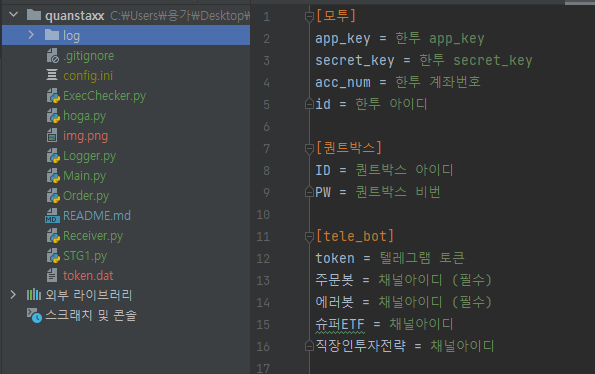

# quanstaxx

안녕하세요, 퀀스택스 입니다. 

퀀트박스 api와 한투 api를 결합한 트레이딩 시스템 입니다. 

1. pip install quantbox
2. 퀀트박스 가입 >> https://www.quantbox.net/bbs/register_form.php
3. 한국투자증권 API 키 신청 >> https://securities.koreainvestment.com/main/member/login/login.jsp?returnUrl=%2Fmain%2Fcustomer%2Fsystemdown%2FRestAPIService.jsp&isXecurePass=Y
4. config.ini 파일을 만들고 아래와 같은 형태로 퀀트박스 계정과 한투계정 그리고 텔레그램 토큰과 채널아이디를 넣습니다. 

5. 텔레그램 토큰발행 및 채널아이디 확인 방법 >> https://py-son.tistory.com/8
6. 모투로 돌려보려면 Main.py 에서 171줄의 motoo를 True, 실거래 하려면 False
7. log 폴더를 추가해 주세요   
8. 준비가 다 되었다면 Main.py를 실행하시면 됩니다. 
   
- 퀀스택스 블로그 >> https://blog.naver.com/quanstaxx
- 퀀스택스 커뮤니티 >> https://open.kakao.com/o/gasnoL8e
- 용돈좀 주세요 >> 645501-01-591035 국민은행